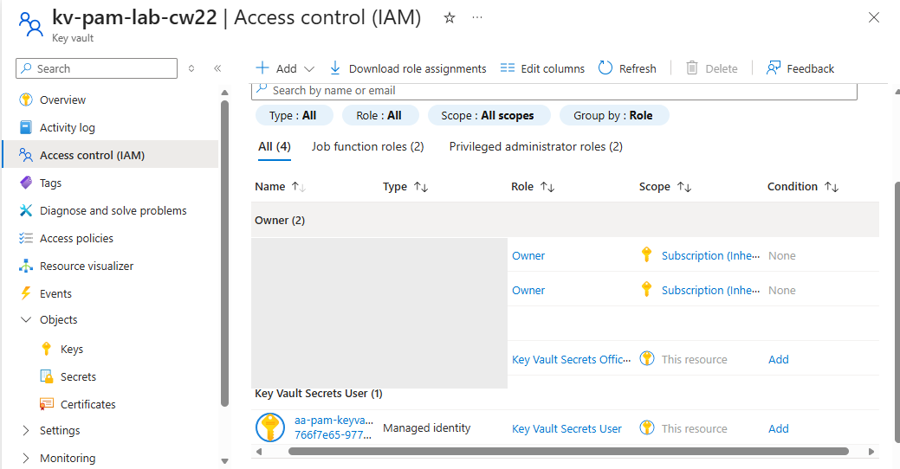
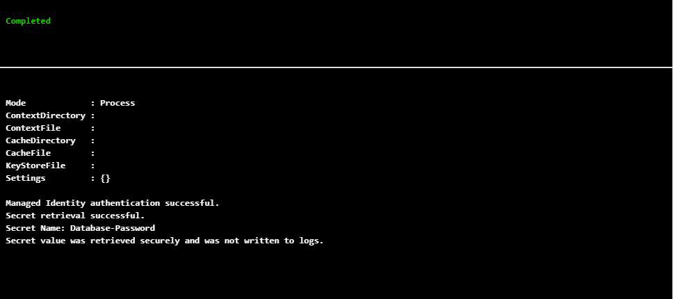
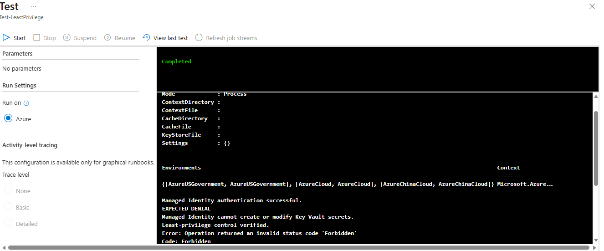
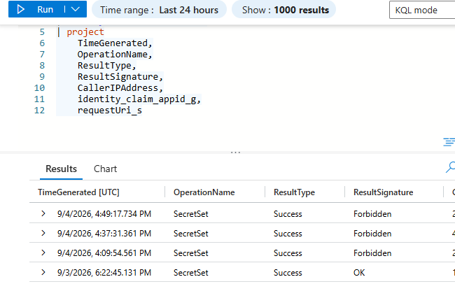
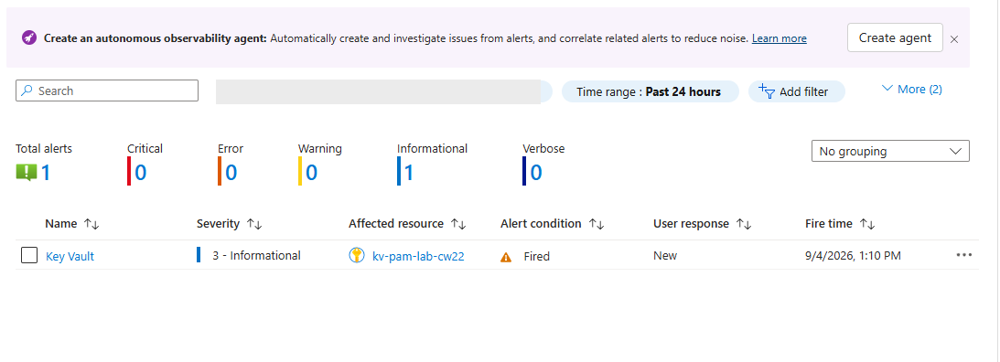

# Azure Key Vault PAM & Secrets Management Lab

## Overview

This project demonstrates the implementation of a secure secrets-management workflow in Microsoft Azure using **Azure Key Vault, Microsoft Entra ID, Managed Identity, Azure RBAC, Azure Automation, Log Analytics, KQL, and Azure Monitor**.

The goal was to allow an automated workload to securely retrieve a protected secret without storing credentials in the automation code, while enforcing least-privilege access and providing auditing and detection for unauthorized activity.

---
## Project Documentation

📄 **[View Full Portfolio Case Study](docs/Azure_PAM_Secrets_Management_Lab_Case_Study.pdf)**

The case study provides a detailed walkthrough of the architecture, RBAC design, managed identity implementation, least-privilege testing, secret rotation, audit logging, KQL detection, and Azure Monitor alerting used in this project.

---

## Architecture

```text
Microsoft Entra ID
        |
        | Managed Identity
        v
Azure Automation
        |
        | Azure RBAC
        v
Azure Key Vault
   |             |
SecretGet     SecretSet
 ALLOWED      FORBIDDEN
   |             |
   +------┬------+
          |
          v
  Diagnostic Logs
          |
          v
   Log Analytics
          |
      KQL Detection
          |
          v
    Azure Monitor
          |
          v
    Email Alert
```

---

## Technologies Used

- Microsoft Entra ID
- Azure Key Vault
- Azure Managed Identity
- Azure RBAC
- Azure Automation
- PowerShell
- Log Analytics
- Kusto Query Language (KQL)
- Azure Monitor
- Azure Action Groups

---

## Security Objectives

The lab was designed around several IAM/PAM security principles:

- Eliminate hard-coded credentials from automation
- Use workload identities for authentication
- Enforce least-privilege authorization
- Centralize privileged secrets
- Support credential rotation
- Audit secret access
- Detect unauthorized operations
- Generate security alerts for suspicious activity

---

## Least-Privilege RBAC Design

The Azure Automation Account uses a **system-assigned managed identity**.

The workload identity was assigned:
### RBAC Configuration



The Azure Automation managed identity is assigned the **Key Vault Secrets User** role at the Key Vault resource scope.

**Key Vault Secrets User**

at the Key Vault resource scope.

This allows the automation workload to retrieve secrets while preventing it from creating or modifying secrets.

### Authorization Testing

| Operation | Expected Result | Result |
|---|---|---|
| Managed Identity authentication | Allowed | ✅ Success |
| SecretGet | Allowed | ✅ Success |
| SecretSet | Denied | ❌ Forbidden |
| Secret rotation by authorized administrator | Allowed | ✅ Success |

This validates both the required access and the authorization boundary.

---

## Secure Secret Retrieval

The PowerShell runbook authenticates to Azure using the Automation Account's managed identity rather than a stored username, password, or client secret.

The runbook retrieves the `Database-Password` secret from Azure Key Vault.

The secret value is intentionally **not written to the Automation job logs**.

Example:
### Validation Evidence



The Automation runbook successfully authenticated using its managed identity and retrieved the secret without exposing the secret value in the job output.

```text
Managed Identity authentication successful.
Secret retrieval successful.
Secret Name: Database-Password
Secret value was retrieved securely and was not written to logs.
```

---

## Least-Privilege Validation

A separate security test attempted to perform a `SecretSet` operation using the Automation managed identity.

The operation was rejected:

```text
EXPECTED DENIAL
Managed Identity cannot create or modify Key Vault secrets.
Least-privilege control verified.

Code: Forbidden
```### Authorization Test Evidence



The managed identity's attempt to create a secret was rejected with **Forbidden**, validating the least-privilege RBAC configuration.

This demonstrated that the workload could consume a secret without receiving unnecessary secret-management privileges.

---

## Logging and Detection

Key Vault diagnostic logging was configured to send audit events to a **Log Analytics workspace**.

KQL was then used to investigate secret operations.

Example query:

```kusto
AzureDiagnostics
| where ResourceProvider == "MICROSOFT.KEYVAULT"
| where OperationName == "SecretSet"
| sort by TimeGenerated desc
| project
    TimeGenerated,
    OperationName,
    ResultType,
    ResultSignature,
    CallerIPAddress,
    identity_claim_appid_g,
    requestUri_s
```

Unauthorized `SecretSet` attempts were recorded with:

```text
ResultSignature = Forbidden
```### Audit Evidence



Log Analytics captured the denied `SecretSet` operations, providing an auditable record of the authorization failure.

---

## Security Alerting

An Azure Monitor log-search alert was configured to detect selected unauthorized Key Vault access.

The detection workflow was:

```text
Unauthorized Key Vault Operation
            |
            v
Key Vault Diagnostic Log
            |
            v
      Log Analytics
            |
            v
        KQL Query
            |
            v
    Azure Monitor Alert
            |
            v
    Action Group / Email
```

A controlled unauthorized-access test successfully triggered the alert.

---
### Alert Evidence



Azure Monitor generated an alert after the controlled unauthorized-access test triggered the configured detection rule.

## Secret Rotation

The `Database-Password` secret was rotated by creating a new Key Vault secret version.

The Automation runbook was executed again **without changing the code** and successfully retrieved the current version of the secret.

This demonstrates how applications can be separated from the underlying credential value and continue operating after credential rotation.

---

## Key Security Controls Demonstrated

| Security Control | Implementation |
|---|---|
| Workload authentication | Managed Identity |
| Secrets management | Azure Key Vault |
| Authorization | Azure RBAC |
| Least privilege | Key Vault Secrets User |
| Credential rotation | Key Vault secret versioning |
| Secure automation | Azure Automation + PowerShell |
| Audit logging | Key Vault diagnostic logs |
| Security investigation | Log Analytics + KQL |
| Detection | Azure Monitor |
| Notification | Azure Action Group |

---

## Key Takeaways

This project provided hands-on experience implementing an end-to-end secrets-management workflow rather than simply storing credentials in a vault.

The lab demonstrates the relationship between **identity, authentication, authorization, secrets management, least privilege, credential rotation, auditing, detection, and alerting** within an Azure environment.

## Disclaimer

This project was created in a personal lab environment for educational and portfolio purposes. No production credentials or organizational data are included in this repository.
